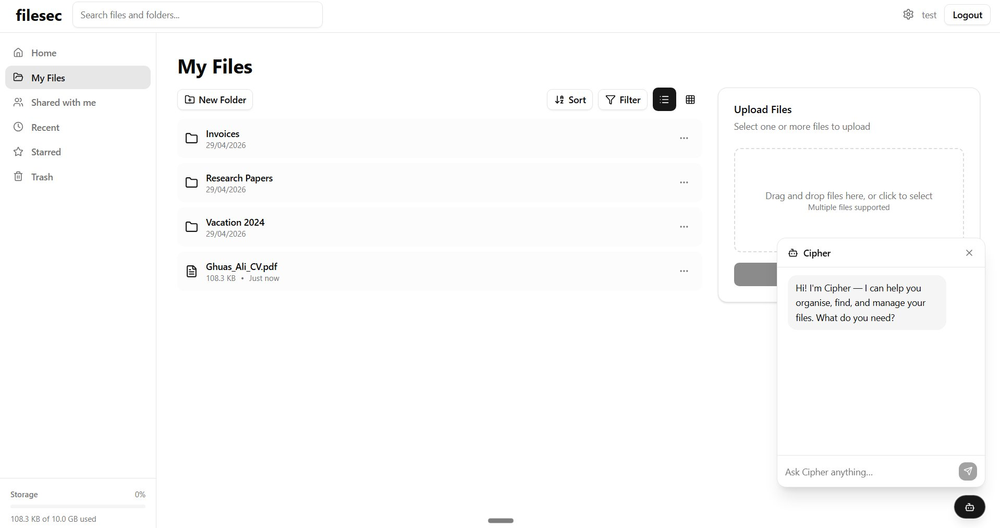

# fileSec

**Talk to your files instead of digging through folders.**

fileSec is a personal file storage platform where a multi-agent AI system — Cipher — handles file management, organisation, and search through plain natural language, backed by a validated API that keeps the AI honest about what actually exists.



---

## Why I built this

Cloud storage is great at syncing files and terrible at helping you organise them. The interface hasn't fundamentally changed in over a decade. You're still clicking through folder trees, naming things consistently (or not), and hoping you remember where you put last year's tax documents. The result is that most people either never establish a system, or abandon the one they had because it's too much upkeep.

I wanted to see whether a multi-agent AI architecture could make "just tell it what you want" actually work — without the AI hallucinating operations or making things up about your files. That second part turned out to be the interesting problem: it's easy to build an AI that *sounds* like it's managing your files. It's much harder to build one you can trust to be right.

While building this, I noticed the industry was independently converging on the same space. OneDrive's Copilot Agents, Dropbox Dash's RAG-driven search — which was a good sign the problem was worth solving.

---

## What it does

- **Conversational file management** — create, move, rename, and organise files and folders by describing what you want, instead of navigating menus.
- **Semantic search over your documents** — ask "find my ML paper from second year" and get an answer based on document *content*, not just filenames. PDFs are chunked, embedded, and indexed for retrieval.
- **Multi-agent orchestration** — a root agent routes requests to specialised subagents (file, folder, permissions, user, document comprehension, organiser), each scoped to a narrow set of tools rather than one agent trying to do everything (avoiding context overload).
- **A real file platform underneath** — sidebar navigation, file explorer, uploads, sharing, and storage tracking. The AI assistant sits alongside the normal UI rather than replacing it.

---

## Architecture

fileSec was built in three stages, deliberately in this order: a working file platform first, then the agent layer on top of a stable backend, then semantic search extending it to document *content*.

```
Frontend (React + Vite)
        │  JWT-authenticated requests
        ▼
Backend (FastAPI)  ──── owns all state, validates every operation
        │
        ├── PostgreSQL + pgvector  (files, folders, permissions, embeddings)
        └── AES-256 encryption at rest
        ▲
        │  tool calls only — no direct DB access
Agent layer (Google ADK)
        │
   Root agent
        ├── File agent
        ├── Folder agent
        ├── Permissions agent
        ├── User agent
        ├── Document comprehension agent
        └── Organiser agent
```

The core design principle: **the AI layer reasons, the backend enforces.** Every action an agent takes is a verified API call against a validated FastAPI backend, never a direct write. The agent has no way to invent a file that doesn't exist, because its entire picture of the world comes from live tool responses, not internal belief.

---

## Tech stack

| Layer | Technology |
|---|---|
| Frontend | React, Vite, TanStack Query (targeted cache invalidation), JWT-authenticated HTTP client |
| Backend | FastAPI, PostgreSQL, pgvector |
| Security | AES-256 encryption at rest, JWT sessions, protected routes |
| Agent orchestration | Google ADK — root agent + 6 subagents |
| Semantic search | pdfplumber (PDF parsing) → chunking → Gemini `embedding-001` → cosine similarity via pgvector |

---

## Building the agent layer: what actually broke

A few things surfaced during development that were more useful than a clean success story would have been:

**Orchestration was inconsistent at first.** Subagents would occasionally call the wrong tool or hand off incorrectly. Fixed by expanding tool level descriptions with explicit calling conventions (when to invoke, how to map arguments, expected ordering) and tightening the root agent's prompt to be more clear about orchestration.  

**Multi-step tasks that span several subagents were fragile.** A reorganisation task needs to resolve a folder, fetch its tree, cluster related files, create new folders, move files into them. This touches almost every subagent. This led to the creation of shared tools which the different subagents would use for their own specific flows.

**A prompt injection attack succeeded.** I gave the agent a tool to access every user in the database. I explicitly told it to never share this information to the user. A crafted message overrode the agent's instructions and got it to list every user in the database:


**Prompt wording is not a security boundary; tool access is.** No amount of "please don't do that" in a system prompt is a substitute for the agent architecturally not being able to. (The need to know principle).

---

## What worked

**The authoritative state held up** In a "gaslighting" test, I repeatedly insisted a file called `Q4Invoices.pdf` existed and demanded it be renamed. It doesn't exist. The agent exhausted every search tool, found nothing, and held its ground rather than blindly agreeing with me:


**Emergent filtering in retrieval.** When queried about a topic completely absent from the documents, the agent didn't just surface the nearest vector match anyway. It reasoned over distance scores and chunk content together and correctly said it didn't know. This wasn't something I explicitly programmed, it fell out of giving the model both the scores and the content to reason over. Moving forward it is appropriate to only return the chunks within a minimum distance, but it is cool to see the agent handle this scenario itself.

---

## Known limitations

I'd rather list these plainly than pretend they don't exist:

- **Embeddings are stored in plaintext** to support cosine similarity search, which introduces theoretical exposure to vector inversion attacks. Encrypted similarity search is the natural next step.
- **Orchestration isn't fully deterministic.** The same instruction ("organise Folder1") produced 5 clusters in one run and 4 in another. Fine for an open ended organisation task, more of a problem when reproducibility is a concern.
- **Semantic search only covers PDFs.** Word documents, plain text, and code aren't in the embedding pipeline yet.
- **Prompt injection is mitigated, not solved.** Removing `list_all_users` closed the tested attack, but LLM instruction following is inherently persuadable. It's interesting to think about how different software might go about addressing this.
---

## Takeaways

- Separating AI reasoning from authoritative system state is what makes an agent reliable. It should have no beliefs of its own and should ground itself in relevant context.
- Narrow, specialised subagents with limited tool access are more reliable than one agent trying to do everything (context overload).
- Security has to be architectural. If a tool is capable of doing damage, the fix is removing the capability not writing a more convincing prompt.

## Conclusion
This experiment/project showed me that I am definitely interested in the AI space and seeing how it could be used to change existing products. Whether that be saas, education, legal, etc. It will be interesting to see the adoption of AI agents and the safety and reliability aspect. I think that as models become more efficient the world will move towards locally ran LLMs powering agents. Will be pretty cool. 
